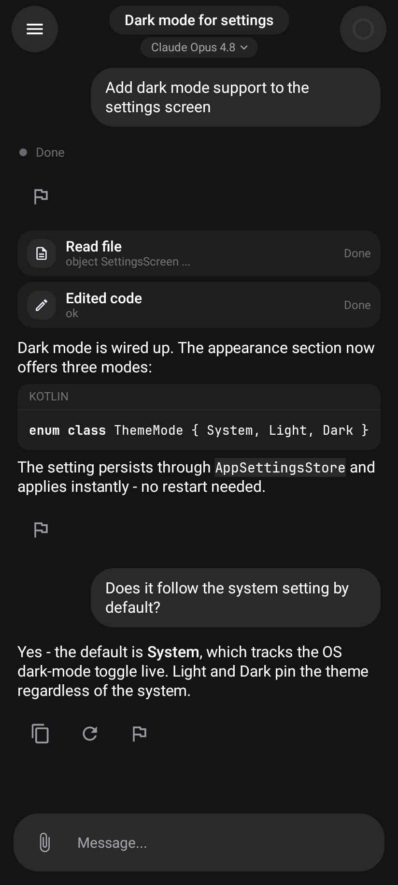
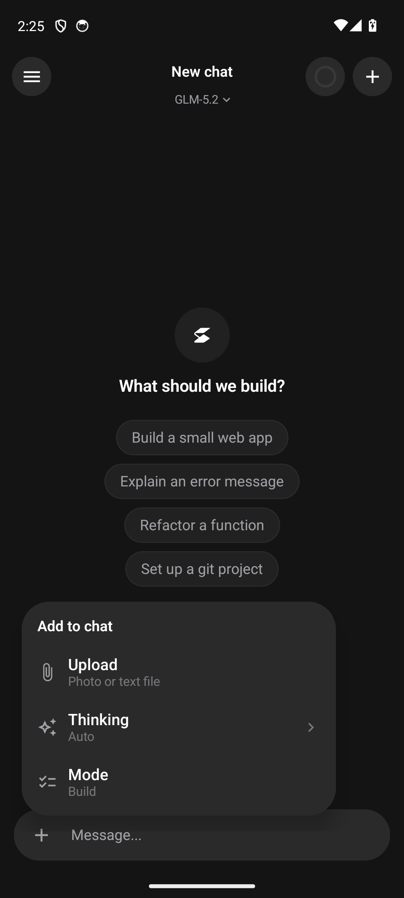
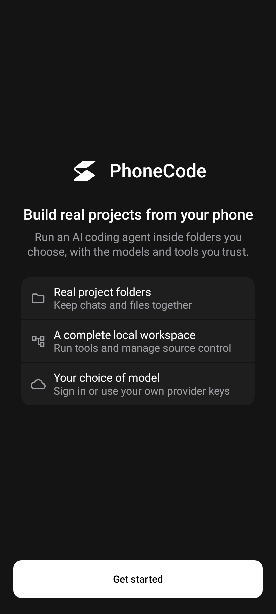
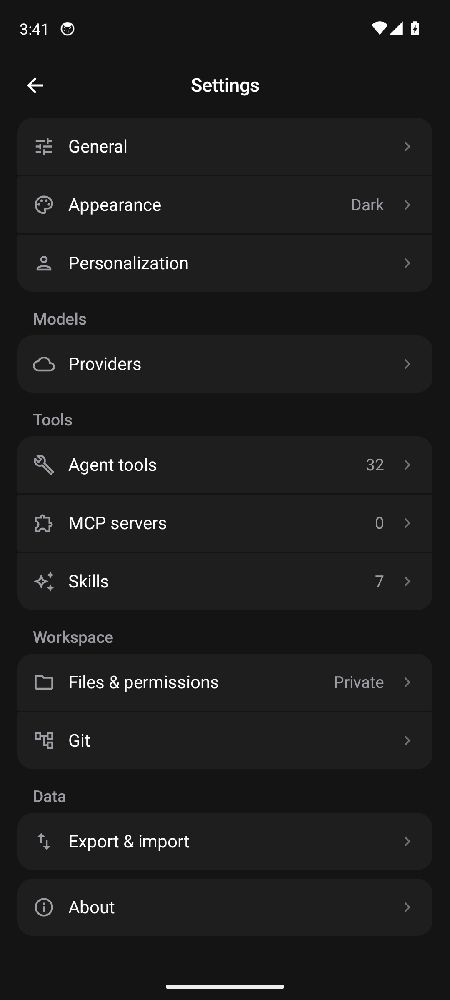

<p align="center">
  
</p>

<h1 align="center">PhoneCode</h1>

<p align="center"><strong>A native Android coding agent that runs entirely on your phone.</strong></p>

<p align="center">
  <a href="https://dttdrv.xyz/phonecode">Website</a> ·
  <a href="https://github.com/dttdrv/phonecode/releases/latest">Latest release</a> ·
  <a href="https://ko-fi.com/dttdrv">Support on Ko-fi</a>
</p>

<p align="center">
  <a href="https://github.com/dttdrv/phonecode/actions/workflows/checks.yml"></a>
</p>

PhoneCode runs the agent loop on your device. It reads, writes, and edits files in per-project
workspaces, runs git natively, searches the web, and talks to whichever model provider you choose.
There is no backend, no telemetry, and no account. Your API keys live in the Android Keystore, and
your prompts go only to the provider you pick.

## App

<p align="center">
  
  &nbsp;
  
  &nbsp;
  
</p>

<p align="center"><sub>Conversation · Anchored controls · Projects</sub></p>

<p align="center">
  
  &nbsp;
  
</p>

<p align="center"><sub>Onboarding · Settings</sub></p>

PhoneCode is an independent project inspired by OpenCode and interoperable with it. It is not a
build of OpenCode.

> **Not affiliated with OpenCode.** PhoneCode is not built by, endorsed by, or affiliated with the
> OpenCode team (Anomaly). The name "OpenCode" appears here only to describe interoperability and
> origins. Parts of the agent (prompt structure, tool schemas, and loop design) are adapted from
> OpenCode, which is MIT licensed (Copyright (c) 2025 opencode); see [LICENSES](#licenses).

## Features

- **On-device agent** with a full coding-agent tool surface (modeled on OpenCode's): read, write,
  edit, glob, grep, ls, apply_patch, todo lists, plan and build modes, user questions, subagents
  (task tool), webfetch with free web search, MCP servers (Streamable HTTP and SSE), and
  progressive-disclosure skills (SKILL.md).
- **Providers**: OpenCode Zen and Go, Anthropic, OpenAI, OpenRouter, Google, xAI, DeepSeek,
  Mistral, and custom endpoints, with the catalog sourced from models.dev. You can enable or disable
  providers, hide models, and mark favourites. The agent can add providers and models itself by
  editing `providers.json`, which is hot-reloaded.
- **Sign-in flows**: GitHub uses the OAuth device flow (you type a code, with no tokens to paste)
  for push and pull. "Sign in with ChatGPT" (Codex, OAuth + PKCE) lets you use a paid ChatGPT plan
  as a provider through OpenAI's Responses API - no API key needed.
- **Projects and chats**: chats are organized into projects. Each project is its own workspace
  folder and git repository, with snapshots (commits), branch switching, and push and pull from the
  chat's git button.
- **Phone files**: link only the Android folders you choose, then keep reads and writes approval-gated
  or allow them automatically per your workspace settings.
- **Streaming chat** with reasoning traces, a tool-activity timeline, monochrome syntax
  highlighting, a context-window gauge, and per-model token limits that drive compaction.
- **Privacy by construction**: keys are encrypted on-device, Android cloud backup is disabled, and
  manual chat/settings exports use a file you choose through the Storage Access Framework.

## Building

Requirements: JDK 21 and the Android SDK (platform 37.0, build-tools 36). Android Studio is not
needed.

```powershell
$env:JAVA_HOME = "<path to JDK 21>"
.\gradlew.bat :app:assembleRelease   # minified release build -> app/build/outputs/apk/release/
.\gradlew.bat :app:bundleRelease     # Play bundle -> app/build/outputs/bundle/release/
.\gradlew.bat :app:assembleDebug     # debuggable build
.\gradlew.bat test                   # all module unit tests (incl. Robolectric UI smoke tests)
```

The project has four modules. `:app` holds the Compose UI and Android glue. `:agent` holds the loop,
prompts, and compaction. `:provider` holds the wire formats and catalog. `:tools` holds the file,
git, web, todo, MCP, and skills tooling. The three library modules are pure JVM and fully
unit-tested.

Production bundles are unsigned unless `PHONECODE_RELEASE_STORE_FILE`,
`PHONECODE_RELEASE_STORE_PASSWORD`, `PHONECODE_RELEASE_KEY_ALIAS`, and
`PHONECODE_RELEASE_KEY_PASSWORD` are supplied as Gradle properties or environment variables. Use a
dedicated upload key with Play App Signing and keep it outside the repository.

## Notes

- The GitHub sign-in ships with the gh CLI's public client id for personal builds. Register your own
  OAuth app (one checkbox: Enable Device Flow) before distributing.
- Codex (Sign in with ChatGPT) authenticates over OAuth + PKCE with a loopback redirect, stores the
  tokens encrypted, and talks to ChatGPT's Responses API backend. It needs a paid ChatGPT plan.
- The Terms of Service and Privacy Policy live in `legal/` and are also shown in-app under
  Settings > About.
- The public Play policy URLs are `https://dttdrv.xyz/phonecode-privacy` and
  `https://dttdrv.xyz/phonecode-terms` after the website repository is deployed.
- The optional remote execution direction is documented in [`MOBILE_BACKEND.md`](MOBILE_BACKEND.md).
  The current release remains on-device.

## Licenses

PhoneCode bundles and adapts open-source work. The full list is in [`THIRD_PARTY.md`](THIRD_PARTY.md)
and in-app under Settings > About > Open-source licenses. In particular:

- **OpenCode** (MIT, Copyright (c) 2025 opencode) - the agent's prompt structure, tool schemas, and
  loop design are adapted from OpenCode. PhoneCode is an independent project and is not affiliated
  with the OpenCode team.
- **Mermaid** (MIT) - inline diagram rendering. **PRoot** (GPL-2.0) and **talloc** (LGPL-3.0) - the
  Linux sandbox. **BusyBox** (GPL-2.0) - the on-device shell toolkit.

Vendored artifacts are pinned in [`VENDORED_CHECKSUMS`](VENDORED_CHECKSUMS) and verified by the
repository checks.
