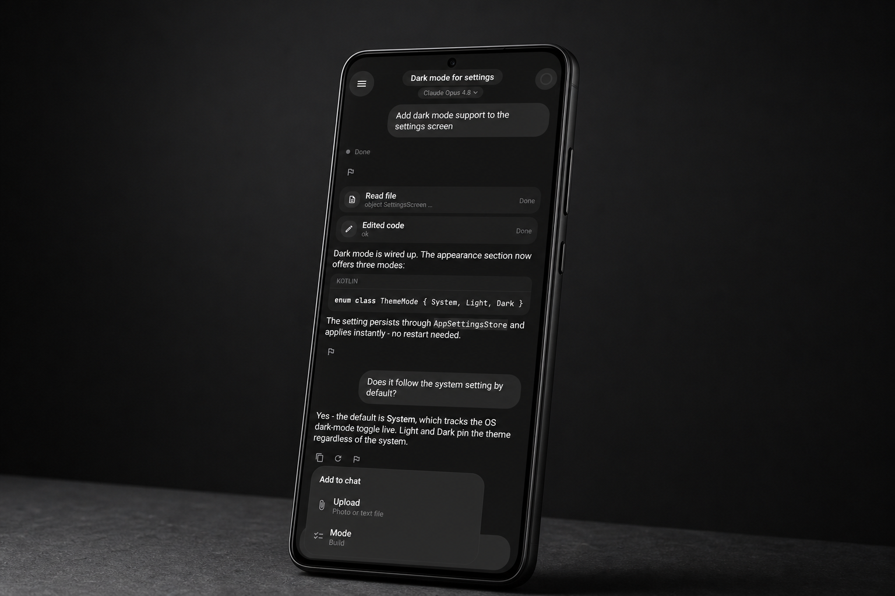
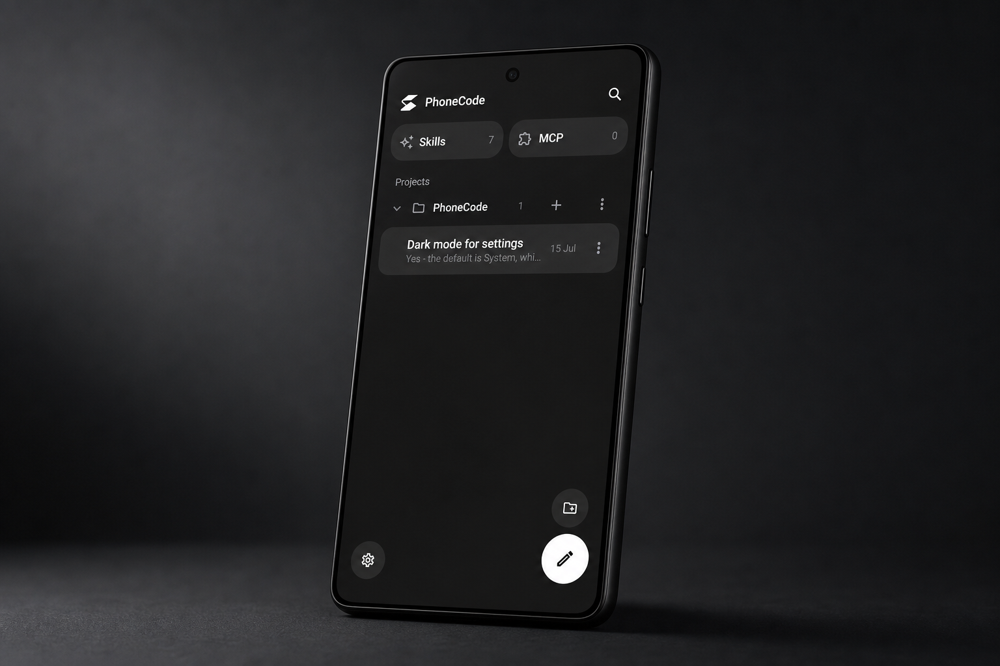
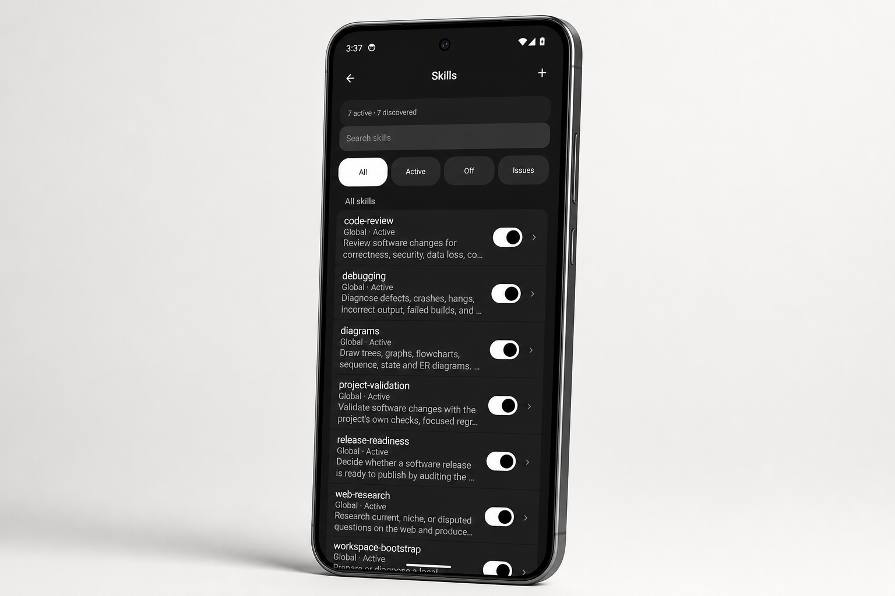
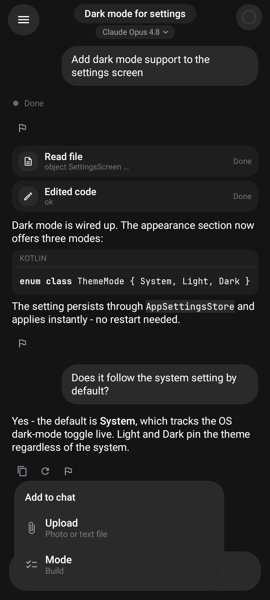
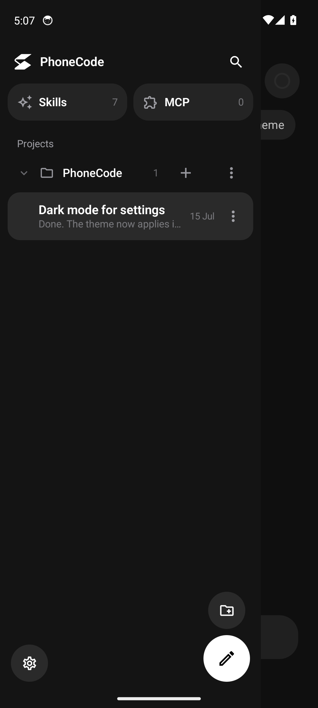

<p align="center">
  
</p>

<h1 align="center">PhoneCode</h1>

<p align="center"><strong>完全在你的 Android 手机上运行的私有原生编程代理。</strong></p>

<p align="center">
  <a href="https://ko-fi.com/dttdrv"><strong>在 Ko-fi 上支持 PhoneCode</strong></a> ·
  <a href="https://dttdrv.xyz/phonecode">网站</a> ·
  <a href="https://github.com/dttdrv/phonecode/releases/latest">最新版本</a>
</p>

<p align="center"><sub>支持是可选的，不会解锁任何功能或服务。</sub></p>

<p align="center">
  <a href="https://github.com/xjioc/phonecode/actions/workflows/checks.yml"></a>
</p>

<p align="center">
  
</p>

PhoneCode 在你的设备上运行代理循环。它可以读写编辑项目工作区中的文件、本地运行 Git 和内置的 Alpine Linux 环境、搜索网页，并与你选择的模型提供商对话。没有通用的 PhoneCode 后端、遥测、远程执行服务或强制账户。唯一由开发者操作的端点只接收你明确提交的 AI 输出报告。API 密钥存放在 Android Keystore 中。

## 为真正的工作而生

<p align="center">
  
  
</p>

<p align="center"><sub>基于文件夹的项目和会话 · 内置、可编辑、热重载的技能</sub></p>

## 界面

<p align="center">
  
  &nbsp;
  
  &nbsp;
  
</p>

<p align="center">
  
  &nbsp;
  
</p>

<p align="center"><sub>对话 · 附件 · 项目 · 引导设置 · 设置</sub></p>

PhoneCode 是一个独立项目，受 OpenCode 启发并与之互操作。它不是 OpenCode 的一个构建版本。

> **与 OpenCode 无关。** PhoneCode 并非由 OpenCode 团队（Anomaly）构建、认可或关联。此处提及 "OpenCode" 仅用于描述互操作性和起源。代理的部分内容（提示结构、工具模式和循环设计）改编自 OpenCode，后者采用 MIT 许可（Copyright (c) 2025 opencode）；参见 [许可证](#许可证)。

## 功能特性

- **设备端代理**，配备有界文件与进程工具、Git、持久化待办列表、计划与构建模式、用户提问、子代理、可取消的网页访问、MCP 服务器和渐进式技能展示。工具输入和有界输出可在聊天时间线中查看。
- **设备端开发运行时正在迁移中。** 当前的 arm64 Alpine/PRoot 运行时是一个侧载开发原型。Google Play 架构采用软件模拟的 QEMU Linux 虚拟机，因此软件包在隔离的 Android 进程后的虚拟 CPU 上执行。在该 VM 边界通过发布门禁之前，应用不会声称支持 Play 之外的任意原生软件包安装。
- **提供商**：OpenCode Zen 和 Go、Anthropic、OpenAI、OpenRouter、Google、xAI、DeepSeek、Mistral 以及自定义端点。模型和推理级别自动从 models.dev 刷新；ChatGPT 登录使用账户认证的 Codex 目录。你可以启用或禁用提供商、隐藏模型以及标记收藏。代理可以通过编辑 `providers.json` 自行添加提供商和模型，支持热重载。
- **登录流程**：GitHub 使用 OAuth 设备流（输入代码，无需粘贴令牌）进行推送和拉取。"使用 ChatGPT 登录"（Codex，OAuth + PKCE）让你通过 OpenAI 的 Responses API 将付费 ChatGPT 计划用作提供商——无需 API 密钥。
- **项目和会话**：聊天按文件夹组织的项目分类。活跃会话状态、部分轮次、工具检查点和待办事项在重启后仍然保留；项目指令可以来自项目根目录的 `AGENTS.md` 或 `CLAUDE.md` 文件。
- **技能和 MCP 管理**：应用内置七个入门技能。全局和项目技能可以创建、编辑、启用和热重载，无需重启聊天。MCP 配置在激活前经过验证，支持实时重连，并清除不可用的工具而非留下过时的工具接口。
- **手机文件**：只链接你选择的 Android 文件夹，然后根据你的工作区设置，将读写操作设为需审批或自动允许。
- **流式聊天**，带有推理过程追踪、工具活动时间线、单色语法高亮、上下文窗口指示器，以及驱动压缩的按模型令牌限制。
- **崩溃安全会话**，支持前台执行、有界预输出重试、持久化工具检查点、原子本地存储、可取消的网络调用，以及在 Android 中断或你停止轮次时的显式恢复。
- **隐私即架构**：密钥在设备上加密存储，Android 云备份已禁用，手动聊天/设置导出使用你通过存储访问框架选择的文件。

## 构建

要求：JDK 21 和 Android SDK（platform 37.0，build-tools 36）。不需要 Android Studio。PhoneCode 支持 Android 8.0 及以上版本。

```bash
./gradlew :app:assembleDebug
./gradlew :provider:test :tools:test :agent:test :app:testDebugUnitTest :app:lintDebug \
  :app:verifyLegalInventory :app:verifyPrototypeRuntimeBoundary
```

项目有四个模块。`:app` 包含 Compose UI 和 Android 胶水代码。`:agent` 包含代理循环、提示词和压缩逻辑。`:provider` 包含网络格式和目录。`:tools` 包含文件、Git、网页、待办、MCP 和技能工具。三个库模块是纯 JVM 的，并经过完整的单元测试。

Google Play 发布工件在 QEMU 运行时、许可、API 和 Android App Bundle 审计通过之前，被有意阻止。当该门禁开启后，请使用专用的上传密钥配合 Play App Signing，并将密钥保存在仓库之外。

## 说明

- GitHub 登录功能随附了 gh CLI 的公共客户端 ID，用于个人构建。在分发前，请注册你自己的 OAuth 应用（勾选一个选项：启用设备流）。
- Codex（使用 ChatGPT 登录）通过 OAuth + PKCE 进行认证，使用回环重定向，将令牌加密存储，并与 ChatGPT 的 Responses API 后端通信。需要付费的 ChatGPT 计划。
- 服务条款和隐私政策位于 `legal/` 目录下，也在应用内设置 > 关于中显示。
- 公开的 Play 政策 URL 将在网站仓库部署后为 `https://dttdrv.xyz/phonecode-privacy` 和 `https://dttdrv.xyz/phonecode-terms`。
- 本地执行架构记录在 [`MOBILE_BACKEND.md`](MOBILE_BACKEND.md) 中。

## 许可证

PhoneCode 的原始代码版权所有 2026 dttdrv，采用 [Apache License 2.0](LICENSE) 许可。

PhoneCode 捆绑并改编了开源作品。完整列表见 [`THIRD_PARTY.md`](THIRD_PARTY.md) 以及应用内设置 > 关于 > 开源许可证。特别说明：

- **OpenCode**（MIT，Copyright (c) 2025 opencode）—— 代理的提示结构、工具模式和循环设计改编自 OpenCode。PhoneCode 是一个独立项目，与 OpenCode 团队无关。
- **Mermaid**（MIT）—— 内联图表渲染。**PRoot**（GPL-2.0）和 **talloc**（LGPL-3.0）—— Linux 兼容层。**BusyBox**（GPL-2.0）和 **Alpine Linux** —— 内置的本地开发环境。

供应工件固定在 [`VENDORED_CHECKSUMS`](VENDORED_CHECKSUMS) 中，并通过仓库检查进行验证。